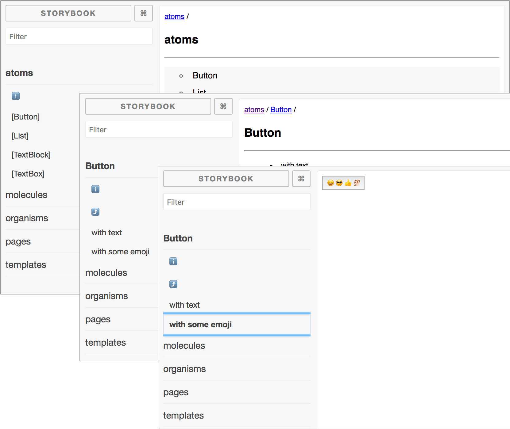
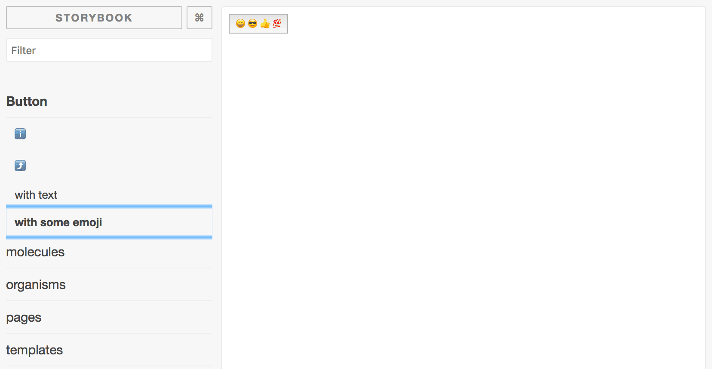

# storybook-directory-chapters


A loader for [Storybook 3.0](https://storybook.js.org/) using [@storybook/addon-chapters](https://github.com/sm-react/storybook-chapters) to automatically generate a tree of chapters that mirrors your direcory structure.

[ [DEMO PAGE](https://ygoto3.github.io/storybook-directory-chapters/) ]



The loader generates hierarchical chapters in your Storybook like above from directory tree like below.

```sh
.
├── atoms
│   ├── Button
│   │   ├── _stories.js
│   │   └── index.js
│   ├── List
│   │   ├── AnotherList
│   │   │   ├── _stories.js
│   │   │   └── index.js
│   │   ├── ListItem.js
│   │   ├── _stories.js
│   │   └── index.js
│   ├── TextBlock
│   │   ├── _stories.js
│   │   └── index.js
│   └── TextBox
│       ├── _stories.js
│       └── index.js
├── molecules
│   └── SearchForm
│       ├── _stories.js
│       └── index.js
├── organisms
│   ├── Footer
│   │   ├── _stories.js
│   │   └── index.js
│   └── Header
│       ├── _stories.js
│       └── index.js
├── pages
│   └── Portal
│       ├── _stories.js
│       └── index.js
└── templates
    └── PortalTemplate
        ├── _stories.js
        └── index.js
```

(Adapting the [Atomic Design](http://bradfrost.com/blog/post/atomic-web-design/) methodology or a similar kind to design your components, you want to organize your components in several categories.)

## Install

Install storybook-directory-chapters via yarn (or npm).

```sh
$ yarn add storybook-directory-chapters -D
```

`storybook-directory-chapters` requires `@storybook/addon-chapters`, so if you have not installed the addon yet, set it up, too.

## Usage

In your Storybook config, pass `loadDirectories()` a given require context of any directory you want your Storybook's navigation tree to mirror.

```javascript
// .storybook/config.js

import { configure } from '@storybook/react';
import '@storybook/addon-chapters';
import loadDirectories from 'storybook-directory-chapters';

// get a context of any directory you want your Storybook's navigation tree to mirror
const context = require.context('../example', true, /_stories.js$/);

function loadStories() {
  // in loadStories(), pass loadDirectories() the context
  loadDirectories(context);
}

configure(loadStories, module);
```

Under the directory you specified, you can add a story to the generated chapters.

```javascript
// atoms/Button/_stories.js

import React from 'react';

module.exports = stories => (
  stories
  .add('with text', () => (
    <button>Hello button</button>
  ))
  .add('with some emoji', () => (
    <button>😀 😎 👍 💯</button>
  ))
);
```

The stories above will become:


